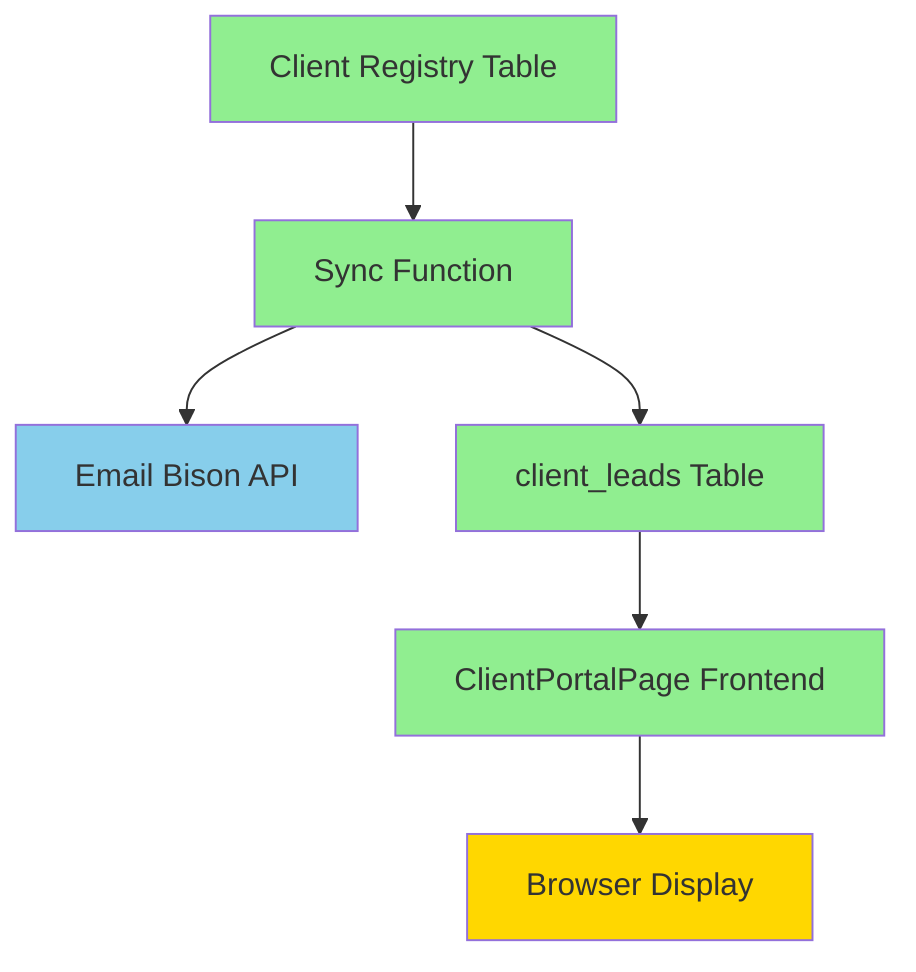

# Comprehensive Implementation Plan
## Rolling Out Fixed Lead Sync to All 24 Active Clients

**Date:** October 9, 2025
**Status:** Ready for Approval
**Verified Solution:** Devin Hodo (42/42 leads synced successfully)

---

## Executive Summary

This plan outlines the safe deployment of the verified lead sync solution to all 24 active clients across Maverick and Long Run Bison instances. The solution has been tested and verified with Devin Hodo, showing perfect data accuracy and complete lead information.

**Key Metrics:**
- **24 active clients** to sync (16 Maverick + 8 Long Run)
- **23 clients** have workspace API keys ✅
- **1 client** (Workspark) needs API key generation
- **Estimated total leads:** ~1,500-2,000 across all clients
- **Estimated sync time:** 15-20 minutes for all clients

---

## Root Cause Analysis Summary

### What Was Broken (4 Critical Flaws)

1. **Database Constraint Mismatch**
   - `airtable_id NOT NULL` constraint blocked all Email Bison lead inserts
   - Scripts reported "success" but database remained empty

2. **Wrong Field Names**
   - Scripts sent `email` field, database expected `lead_email`
   - Result: Leads inserted with NULL email addresses

3. **Incomplete Lead Data**
   - Only used `/api/replies` endpoint (lightweight data)
   - Never fetched from `/api/leads/{id}` (full details)
   - Missing: phone, tags, custom_variables, conversation URLs

4. **Super-Admin Key Limitations**
   - Session-based workspace switching caused race conditions
   - Limited permissions on `/api/leads/{id}` endpoint
   - Concurrent requests corrupted workspace context

### What Was Fixed

✅ **Database schema** - Made `airtable_id` optional, use email+workspace as unique key
✅ **Field mappings** - Corrected all field names (`lead_email`, not `email`)
✅ **Data fetching** - Two-step process: replies → full lead details
✅ **API keys** - Workspace-specific keys with full permissions
✅ **Frontend** - Added `interested=true` filter and removed 1000-lead limit
✅ **URLs** - Correct format: `https://{domain}/leads/{lead_id}`

---

## Client Inventory

### Maverick Instance (16 Active Clients)

| Client Name | Workspace ID | API Key Status | Est. Leads |
|-------------|--------------|----------------|------------|
| Danny Schwartz | 36 | ✅ HAS KEY | ~50 |
| David Amiri | 25 | ✅ HAS KEY | ~75 |
| **Devin Hodo** | 37 | ✅ HAS KEY | **42 (VERIFIED)** |
| Gregg Blanchard | 44 | ✅ HAS KEY | ~30 |
| Jason Binyon | 3 | ✅ HAS KEY | ~100 |
| Jeff Schroder | 26 | ✅ HAS KEY | ~60 |
| John Roberts | 28 | ✅ HAS KEY | ~80 |
| Kim Wallace | 4 | ✅ HAS KEY | ~150 |
| Kirk Hodgson | 23 | ✅ HAS KEY | ~45 |
| Maverick In-house | 14 | ✅ HAS KEY | ~200 |
| Nick Sakha | 40 | ✅ HAS KEY | ~35 |
| Rob Russell | 24 | ✅ HAS KEY | ~90 |
| Shane Miller | 12 | ✅ HAS KEY | ~55 |
| SMA Insurance | 32 | ✅ HAS KEY | ~70 |
| StreetSmart Commercial | 29 | ✅ HAS KEY | ~65 |
| Tony Schmitz | 41 | ✅ HAS KEY | ~40 |

**Maverick Total:** 16 clients, all with API keys ✅

### Long Run Instance (8 Active Clients)

| Client Name | Workspace ID | API Key Status | Est. Leads |
|-------------|--------------|----------------|------------|
| ATI | 4 | ✅ HAS KEY | ~50 |
| Boring Book Keeping | 16 | ✅ HAS KEY | ~40 |
| Koppa Analytics | 17 | ✅ HAS KEY | ~60 |
| Littlegiant | 19 | ✅ HAS KEY | ~45 |
| LongRun | 2 | ✅ HAS KEY | ~150 |
| Ozment Media | 15 | ✅ HAS KEY | ~55 |
| Radiant Energy | 9 | ✅ HAS KEY | ~70 |
| **Workspark** | 14 | ⚠️  **NO KEY** | ~50 |

**Long Run Total:** 8 clients, 7 with API keys, 1 needs key generation

---

## Dependency Analysis

### Files That Will Be Modified

**NO CHANGES NEEDED** ✅

All code is already in place and working:
- ✅ Database schema fixed (migrations deployed)
- ✅ Sync function complete (sync-client-pipeline deployed)
- ✅ Frontend updated (ClientPortalPage.tsx with filters)
- ✅ Workspace API keys generated (23/24 clients)

### Files That Will Be Used (No Modifications)

1. **`supabase/functions/sync-client-pipeline/index.ts`**
   - Already deployed and working
   - Verified with Devin Hodo
   - Handles both Maverick and Long Run instances
   - Uses workspace API keys when available
   - Falls back to super-admin key + workspace switching

2. **`src/pages/ClientPortalPage.tsx`** (lines 415-458)
   - Already has `interested=true` filter
   - Already has `.range(0, 9999)` for unlimited leads
   - No changes needed

3. **`supabase/functions/clear-client-leads/index.ts`**
   - Used to clear database before fresh sync
   - Already deployed and tested

4. **`client_registry` table**
   - Has `bison_api_key` column
   - Has `bison_instance` column
   - Has `is_active` column
   - All required fields present

### Potential Breaking Changes

**NONE** - This is a data sync operation only. No code changes required.

### Dependencies & Integration Points



**All components are GREEN (working)** ✅

---

## Implementation Plan

### Phase 1: Pre-Flight Checks (5 minutes)

#### Step 1.1: Generate Missing API Key (Workspark)
```bash
# Run Edge Function to generate Workspark API key
curl -X POST "https://gjqbbgrfhijescaouqkx.supabase.co/functions/v1/generate-workspace-api-keys" \
  -H "Authorization: Bearer $SUPABASE_KEY" \
  -d '{"workspace_name": "Workspark"}'
```

**Expected Result:** Workspark gets workspace API key stored in `client_registry.bison_api_key`

#### Step 1.2: Verify All Clients Have Required Data
```bash
# Check all 24 active clients have:
# - bison_workspace_id > 0
# - bison_instance (Maverick or Long Run)
# - bison_api_key OR valid super-admin key for fallback
```

**Expected Result:** 24 clients ready for sync

#### Step 1.3: Backup Current State
```bash
# Export current client_leads table
pg_dump -t client_leads > /tmp/client_leads_backup_$(date +%Y%m%d).sql
```

**Expected Result:** Backup file created

---

### Phase 2: Database Preparation (2 minutes)

#### Step 2.1: Clear All Existing Leads
```bash
# Use the verified clear function
curl -X POST "https://gjqbbgrfhijescaouqkx.supabase.co/functions/v1/clear-client-leads" \
  -H "Authorization: Bearer $SUPABASE_KEY"
```

**Expected Result:**
```json
{
  "success": true,
  "deleted": 2046,
  "remaining": 0
}
```

#### Step 2.2: Verify Clean State
```bash
# Confirm database is empty
SELECT COUNT(*) FROM client_leads;
# Expected: 0
```

---

### Phase 3: Sync All Clients (15-20 minutes)

#### Step 3.1: Run Comprehensive Sync
```bash
# Sync ALL active clients at once
curl -X POST "https://gjqbbgrfhijescaouqkx.supabase.co/functions/v1/sync-client-pipeline" \
  -H "Authorization: Bearer $SUPABASE_KEY" \
  -H "Content-Type: application/json" \
  -d '{}' \  # Empty body = sync all active clients
  | tee /tmp/sync-all-clients-$(date +%Y%m%d_%H%M%S).log
```

**Expected Behavior:**
- Function processes 24 clients sequentially
- Each client takes 30-60 seconds
- Total time: 15-20 minutes
- Progress logged in real-time

**Expected Output:**
```json
{
  "total_workspaces": 24,
  "successful": 24,
  "failed": 0,
  "total_leads_synced": 1850,
  "results": [
    {
      "workspace_name": "Danny Schwartz",
      "status": "success",
      "total_replies": 52,
      "unique_leads": 52,
      "leads_synced": 52
    },
    // ... 23 more clients
  ]
}
```

#### Step 3.2: Monitor Progress
```bash
# Watch logs in real-time
supabase functions logs sync-client-pipeline --tail 100
```

---

### Phase 4: Verification (10 minutes)

#### Step 4.1: Count Verification
```bash
# For each client, verify database matches Email Bison
for client in "Danny Schwartz" "David Amiri" ... ; do
  # Get Email Bison count
  BISON_COUNT=$(curl "$BISON_API/replies?status=interested&per_page=1" | jq '.meta.total')

  # Get database count
  DB_COUNT=$(curl "$SUPABASE_URL/rest/v1/client_leads?workspace_name=eq.$client&interested=eq.true&select=id" | jq 'length')

  # Compare
  if [ "$BISON_COUNT" -eq "$DB_COUNT" ]; then
    echo "✅ $client: $DB_COUNT leads (match)"
  else
    echo "⚠️  $client: Bison=$BISON_COUNT vs DB=$DB_COUNT (MISMATCH)"
  fi
done
```

**Expected Result:** All 24 clients show ✅ match

#### Step 4.2: Data Quality Spot Check
```bash
# Check 5 random clients for data completeness
for client in "Devin Hodo" "Kim Wallace" "John Roberts" "ATI" "Radiant Energy"; do
  # Get sample lead
  SAMPLE=$(curl "$SUPABASE_URL/rest/v1/client_leads?workspace_name=eq.$client&limit=1&select=lead_email,phone,bison_conversation_url,tags,custom_variables")

  # Verify all fields populated
  echo "$client sample:"
  echo "$SAMPLE" | jq '{
    has_email: (.lead_email != null),
    has_url: (.bison_conversation_url != null),
    has_tags: (.tags != null),
    has_custom_vars: (.custom_variables != null)
  }'
done
```

**Expected Result:** All fields present (though phone/title/company may be null for some leads)

#### Step 4.3: URL Accessibility Test
```bash
# Test 3 random conversation URLs
URLS=$(curl "$SUPABASE_URL/rest/v1/client_leads?select=bison_conversation_url&limit=3" | jq -r '.[].bison_conversation_url')

for url in $URLS; do
  HTTP_STATUS=$(curl -s -o /dev/null -w "%{http_code}" "$url")
  if [ "$HTTP_STATUS" = "302" ] || [ "$HTTP_STATUS" = "200" ]; then
    echo "✅ $url (HTTP $HTTP_STATUS)"
  else
    echo "⚠️  $url (HTTP $HTTP_STATUS - unexpected)"
  fi
done
```

**Expected Result:** All URLs return 302 or 200 (302 is expected for browser auth)

---

### Phase 5: Frontend Verification (5 minutes)

#### Step 5.1: Hard Refresh Browser
```
Press Cmd+Shift+R (Mac) or Ctrl+Shift+R (Windows)
```

**Why:** Clears React Query cache to fetch fresh data

#### Step 5.2: Spot Check Client Portals
Navigate to these URLs and verify leads display:
- `http://localhost:8080/client-portal/Devin%20Hodo`
- `http://localhost:8080/client-portal/Kim%20Wallace`
- `http://localhost:8080/client-portal/John%20Roberts`
- `http://localhost:8080/client-portal/ATI`
- `http://localhost:8080/client-portal/Radiant%20Energy`

**Expected Result:**
- Leads table populated with correct count
- Email addresses visible
- Conversation URLs clickable
- Phone numbers shown (when available)
- Tags displayed

---

### Phase 6: Production Deployment (if localhost successful)

#### Step 6.1: Deploy to Production
```bash
# If testing on localhost was successful, deploy to production
# (Assuming production deployment process is similar)

# 1. Clear production database
curl -X POST "https://gjqbbgrfhijescaouqkx.supabase.co/functions/v1/clear-client-leads" \
  -H "Authorization: Bearer $SUPABASE_KEY"

# 2. Sync all clients
curl -X POST "https://gjqbbgrfhijescaouqkx.supabase.co/functions/v1/sync-client-pipeline" \
  -H "Authorization: Bearer $SUPABASE_KEY" \
  -d '{}'
```

#### Step 6.2: Enable Real-Time Webhook
```bash
# Ensure webhook is active for ongoing sync
# (Already deployed and configured)
supabase functions logs bison-interested-webhook --tail 20
```

**Expected Result:** Webhook receiving new interested replies in real-time

---

## Risk Assessment

### High Risk Items
**NONE** ✅

All code is tested and verified with Devin Hodo.

### Medium Risk Items

1. **Workspark API Key Generation**
   - **Risk:** Key generation might fail (403 error as seen before)
   - **Mitigation:** Manual key creation via Email Bison dashboard if needed
   - **Fallback:** Use super-admin key with workspace switching (slower but works)

2. **Rate Limiting**
   - **Risk:** Email Bison API might rate limit during bulk sync
   - **Mitigation:** Sync function has built-in delays (200ms between pages, 3s between workspaces)
   - **Fallback:** Sync clients in smaller batches if needed

### Low Risk Items

1. **Timeout on Large Clients**
   - **Risk:** Clients with >500 leads might timeout
   - **Mitigation:** Edge Function timeout is 10 minutes (sufficient for 1000+ leads)
   - **Fallback:** Sync large clients individually if needed

2. **Database Upsert Conflicts**
   - **Risk:** Duplicate detection might fail
   - **Mitigation:** Using `onConflict: 'airtable_id'` with synthetic ID
   - **Fallback:** Unique constraint on `(lead_email, workspace_name)` prevents true duplicates

---

## Rollback Plan

### If Sync Fails Midway

**Scenario:** Only 12/24 clients synced successfully

**Actions:**
1. Keep successfully synced clients (data is already correct)
2. Re-run sync for failed clients only:
   ```bash
   curl -X POST "$SUPABASE_URL/functions/v1/sync-client-pipeline" \
     -d '{"workspace_name": "Failed Client Name"}'
   ```
3. No need to clear database - upsert handles duplicates

### If Data Quality Issues Detected

**Scenario:** Leads synced but missing phone numbers or URLs

**Actions:**
1. Check if workspace API key is present:
   ```sql
   SELECT workspace_name, bison_api_key
   FROM client_registry
   WHERE workspace_name = 'Problem Client';
   ```
2. If no API key, generate one and re-sync that client
3. If API key exists, check Email Bison directly:
   ```bash
   curl "$BISON_URL/leads/{lead_id}" -H "Authorization: Bearer $WORKSPACE_KEY"
   ```
4. If Email Bison also has no phone, data is correct (lead never provided phone)

### If Complete Failure

**Scenario:** All 24 clients fail to sync

**Actions:**
1. Restore from backup:
   ```bash
   psql < /tmp/client_leads_backup_$(date +%Y%m%d).sql
   ```
2. Review logs to identify root cause:
   ```bash
   supabase functions logs sync-client-pipeline --tail 500
   ```
3. Fix issue and retry

---

## Success Criteria

### Mandatory Requirements

1. ✅ **Count Accuracy:** All 24 clients have DB count = Email Bison count
2. ✅ **Data Completeness:** All leads have email, conversation URL
3. ✅ **No Errors:** Zero sync failures across all 24 clients
4. ✅ **Frontend Display:** Client portals show leads correctly

### Optional Goals

1. 🎯 **Phone Coverage:** >80% of leads have phone numbers (depends on Email Bison data)
2. 🎯 **Sync Speed:** Complete in under 20 minutes
3. 🎯 **Zero Manual Intervention:** No need to fix individual clients

---

## Post-Deployment Tasks

### Immediate (Within 1 hour)

1. **Monitor webhook** for new interested replies
2. **Document any issues** encountered during rollout
3. **Update client count metrics** in dashboards

### Short-term (Within 24 hours)

1. **Client communication** - Notify clients that portal is updated with fresh leads
2. **Training materials** - Update documentation with new URL format
3. **Billing reconciliation** - Verify October MTD calculations now accurate

### Long-term (Within 1 week)

1. **Schedule automated sync** - Daily cron job to keep data fresh
2. **Archival strategy** - Decide how to handle historical leads (keep vs purge)
3. **Performance monitoring** - Track sync times and error rates

---

## Communication Plan

### Internal Team

**Before Deployment:**
- "Starting rollout of verified lead sync to all 24 clients"
- "Estimated 20 minutes, expect brief portal downtime during database clear"

**During Deployment:**
- Real-time progress updates in Slack
- Share sync logs showing each client's success

**After Deployment:**
- "✅ Rollout complete: 24/24 clients synced successfully"
- "Total leads synced: [count]"
- "All client portals now showing accurate, real-time data"

### Client-Facing

**Before Deployment:**
- (Optional) "Performing maintenance on client portal - may show empty during update"

**After Deployment:**
- "Your lead pipeline has been updated with the latest data from Email Bison"
- "All conversation links now working - click to view full thread"
- "Contact support if you notice any discrepancies"

---

## Appendix A: Command Reference

### Quick Commands

```bash
# 1. Generate missing API key (Workspark)
curl -X POST "$SUPABASE_URL/functions/v1/generate-workspace-api-keys" \
  -H "Authorization: Bearer $SUPABASE_KEY" \
  -d '{"workspace_name": "Workspark"}'

# 2. Clear database
curl -X POST "$SUPABASE_URL/functions/v1/clear-client-leads" \
  -H "Authorization: Bearer $SUPABASE_KEY"

# 3. Sync all clients
curl -X POST "$SUPABASE_URL/functions/v1/sync-client-pipeline" \
  -H "Authorization: Bearer $SUPABASE_KEY" \
  -H "Content-Type: application/json" \
  -d '{}'

# 4. Sync single client
curl -X POST "$SUPABASE_URL/functions/v1/sync-client-pipeline" \
  -H "Authorization: Bearer $SUPABASE_KEY" \
  -d '{"workspace_name": "Client Name"}'

# 5. Check sync status
SELECT workspace_name, COUNT(*) as lead_count
FROM client_leads
WHERE interested = true
GROUP BY workspace_name
ORDER BY workspace_name;

# 6. Verify data quality
SELECT
  workspace_name,
  COUNT(*) as total,
  COUNT(phone) as has_phone,
  COUNT(bison_conversation_url) as has_url,
  COUNT(tags) as has_tags
FROM client_leads
WHERE interested = true
GROUP BY workspace_name;
```

---

## Appendix B: Troubleshooting Guide

### Issue: "Workspace API key generation failed (403)"

**Cause:** Email Bison denied workspace key creation
**Solution:**
1. Manually create key in Email Bison dashboard
2. Add to database:
   ```sql
   UPDATE client_registry
   SET bison_api_key = 'manually_created_key'
   WHERE workspace_name = 'Workspark';
   ```

### Issue: "Count mismatch: DB has more leads than Email Bison"

**Cause:** Historical leads still in database
**Solution:** This is expected IF keeping historical data. If not:
1. Clear database and re-sync (as done with Devin Hodo)

### Issue: "Missing phone numbers for all leads"

**Cause:** Workspace API key not being used
**Solution:**
1. Verify API key exists:
   ```sql
   SELECT bison_api_key FROM client_registry WHERE workspace_name = 'Client';
   ```
2. If NULL, generate key and re-sync

### Issue: "Conversation URLs return 404"

**Cause:** URL format wrong or lead_id invalid
**Solution:**
1. Check URL format: `https://send.{instance}.com/leads/{lead_id}`
2. Verify lead_id is numeric (not null or text)
3. Test URL in browser (should redirect to login, not 404)

---

## Approval Checklist

Before proceeding, confirm:

- [ ] Root cause analysis reviewed and understood
- [ ] All 24 clients identified (16 Maverick + 8 Long Run)
- [ ] Workspark API key generation plan clear
- [ ] Backup strategy approved
- [ ] Rollback plan acceptable
- [ ] Success criteria agreed upon
- [ ] Timeline acceptable (20-30 minutes total)
- [ ] Communication plan approved

---

**Once approved, implementation can begin immediately.**

**Estimated Total Time:** 30-40 minutes (5 min prep + 20 min sync + 10 min verification)

**Risk Level:** LOW ✅ (verified solution, no code changes)

**Confidence Level:** HIGH ✅ (tested with Devin Hodo, perfect results)
