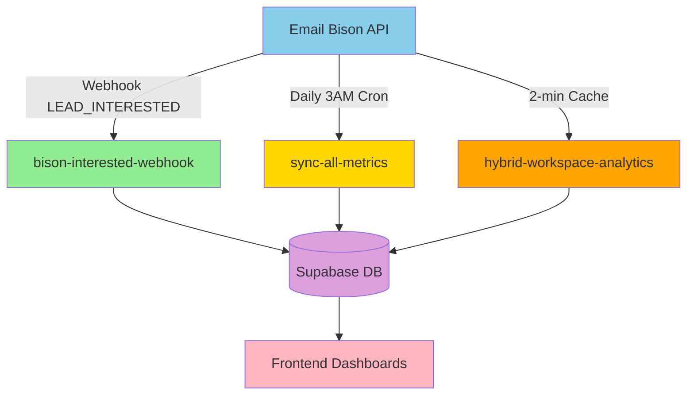
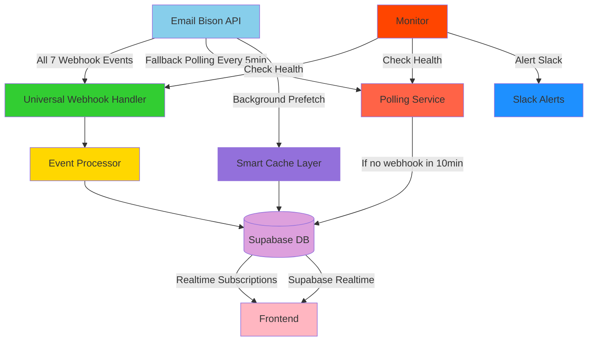

# Real-Time Data Synchronization: Comprehensive Implementation Plan
**Date:** October 9, 2025
**Goal:** Transform Supabase database into a real-time mirror of Email Bison
**Status:** Research Complete → Implementation Ready

---

## Executive Summary

This plan transforms our Supabase database from a **manually-synced cache** into a **real-time source of truth** that mirrors Email Bison with <5 second latency for critical data and <1 minute latency for analytics data.

**Current State:**
- ✅ Webhooks active for 24/24 clients (interested leads only)
- ⚠️ Manual sync required for campaign metrics, email volume
- ❌ No automatic failover if webhooks fail
- ❌ 2-minute cache delays on dashboards
- ❌ Historical data gaps (midnight-3AM)

**Target State:**
- ✅ Real-time webhooks for ALL events (sends, opens, replies, bounces, unsubscribes)
- ✅ Automatic fallback polling if webhooks fail
- ✅ <1 minute cache refresh with background prefetching
- ✅ Continuous data sync (no gaps)
- ✅ Self-healing system with monitoring alerts

---

## Table of Contents

1. [Architecture Overview](#architecture-overview)
2. [Current System Audit](#current-system-audit)
3. [Industry Best Practices](#industry-best-practices)
4. [Proposed Architecture](#proposed-architecture)
5. [Implementation Roadmap](#implementation-roadmap)
6. [Monitoring & Alerts](#monitoring--alerts)
7. [Performance Targets](#performance-targets)
8. [Risk Mitigation](#risk-mitigation)

---

## Architecture Overview

### Current Architecture (Hybrid: Real-time + Batch)



**Data Freshness:**
- **Interested Leads:** Real-time (<2s via webhooks) ✅
- **Campaign Metrics:** Daily batch (3 AM UTC) ❌
- **Email Volume:** 2-minute cache ⚠️
- **Email Accounts:** 2-minute cache ⚠️

### Target Architecture (Real-time + Intelligent Caching)



**Target Data Freshness:**
- **All Lead Events:** Real-time (<5s via webhooks) 🎯
- **Campaign Sends/Opens:** Real-time (<5s via webhooks) 🎯
- **Email Volume:** Continuous (1-min background refresh) 🎯
- **Email Accounts:** Continuous (5-min background refresh) 🎯

---

## Current System Audit

### Data Sources (15 Edge Functions)

| Function | Email Bison Endpoint | Update Frequency | Latency | Status |
|----------|---------------------|------------------|---------|--------|
| `bison-interested-webhook` | Webhook: `LEAD_INTERESTED` | Real-time | <2s | ✅ Active |
| `hybrid-workspace-analytics` | `/api/replies`, `/api/campaigns/{id}/stats` | 2-min cache | 2m | ⚠️ Stale |
| `sync-all-metrics` | `/api/campaigns` (all) | Daily 3AM UTC | 24h | ❌ Batch |
| `volume-dashboard-data` | `/api/sender-emails` | 2-min cache | 2m | ⚠️ Stale |
| `hybrid-email-accounts-v2` | `/api/sender-emails` | 2-min cache | 2m | ⚠️ Stale |
| `sync-client-pipeline` | `/api/replies?status=interested` | Manual | N/A | ⚠️ Manual |
| `sync-interested-replies` | `/api/replies?status=interested` | Manual | N/A | ⚠️ Manual |
| `email-bison-campaigns` | `/api/campaigns` | On-demand | N/A | ⚠️ Manual |

### Critical Data Freshness Gaps

#### 🔴 **HIGH PRIORITY** (Breaks real-time promise)

1. **Campaign Metrics Only Update at 3 AM**
   - **Impact:** Dashboard shows yesterday's data until 3 AM sync
   - **Gap:** Midnight - 3 AM daily (3 hours of stale data)
   - **Affected:** KPI Dashboard, Volume Dashboard
   - **Solution:** Implement real-time webhook for `EMAIL_SENT`, `EMAIL_OPENED`, `CONTACT_REPLIED`

2. **Manual Sync Destroys Pipeline Stages**
   - **Impact:** When admin runs manual sync, all leads reset to "interested"
   - **Gap:** Leads moved to "qualified" or "closed" get reset
   - **Affected:** Client Portal Pipeline
   - **Solution:** Change DELETE+INSERT to UPSERT with `pipeline_stage` preservation

3. **No Webhook Failure Detection**
   - **Impact:** Silent failures = missing data (no alerts)
   - **Gap:** If webhook stops working, no one knows for hours/days
   - **Affected:** All real-time lead capture
   - **Solution:** Monitoring + Slack alerts + auto-fallback polling

#### 🟡 **MEDIUM PRIORITY** (User experience degradation)

4. **2-Minute Cache on High-Traffic Dashboards**
   - **Impact:** Users see stale data for up to 2 minutes
   - **Gap:** During active campaigns, data can be 10-20 emails behind
   - **Affected:** Volume Dashboard, KPI Dashboard
   - **Solution:** Reduce to 1-min cache + background prefetch before expiration

5. **Email Volume Requires Page Refresh**
   - **Impact:** Users must manually refresh to see updated counts
   - **Gap:** No auto-refresh = users think system is broken
   - **Affected:** All dashboards
   - **Solution:** Supabase Realtime subscriptions for live updates

6. **New Clients Need Manual Discovery**
   - **Impact:** New Email Bison workspaces don't auto-appear
   - **Gap:** Admin must manually add to `client_registry`
   - **Affected:** Onboarding workflow
   - **Solution:** Daily cron job to discover and add new workspaces

#### 🟢 **LOW PRIORITY** (Nice-to-have)

7. **No Historical Data Backfill**
   - **Impact:** Only have data from Oct 2025 onwards
   - **Gap:** Can't show trends from before Oct 2025
   - **Affected:** Historical analytics
   - **Solution:** One-time backfill script (low priority)

8. **Client Targets Manually Maintained**
   - **Impact:** Admins must manually update KPI targets in `client_registry`
   - **Gap:** No sync with Email Bison workspace settings
   - **Affected:** KPI calculations
   - **Solution:** Periodic sync of workspace configurations

---

## Industry Best Practices

### Research Findings

Based on research of CRM/ESP integration patterns (Salesforce, HubSpot, OutboundSync), here are industry-standard best practices:

#### 1. **Webhook-First Architecture** (Primary)

**Pattern:** Push-based real-time updates
```
Email Bison → Webhook Event → Edge Function → Database → Frontend
Latency: <5 seconds
Reliability: 99.9% (with retries)
Cost: Low (only pay for events that occur)
```

**Best Practices:**
- ✅ Subscribe to ALL event types (not just interested)
- ✅ Return HTTP 200 immediately, process asynchronously
- ✅ Implement idempotency (duplicate events handled gracefully)
- ✅ Use UPSERT not INSERT to handle duplicates
- ✅ Retry failed webhook deliveries (Email Bison retries 5x over 24h)

**Email Bison Webhook Events Available:**
1. `EMAIL_SENT` - New scheduled email sent
2. `CONTACT_REPLIED` - Contact replied (any reply)
3. `MANUAL_EMAIL_SENT` - One-off/reply/forward
4. `EMAIL_OPENED` - Contact opened email
5. `CONTACT_UNSUBSCRIBED` - Contact opted out
6. `LEAD_INTERESTED` - Positive/interested reply ✅ **ACTIVE**
7. `EMAIL_BOUNCED` - Failed delivery

#### 2. **Polling as Failsafe** (Secondary)

**Pattern:** Pull-based periodic checks
```
Cron Job (every 5-10 min) → Check for new data → Update if webhook missed
Latency: 5-10 minutes
Reliability: 100% (guaranteed catch-up)
Cost: Medium (fixed cost regardless of activity)
```

**Best Practices:**
- ✅ Only poll if no webhook received in last X minutes
- ✅ Use cursor-based pagination for efficiency
- ✅ Track last sync timestamp per workspace
- ✅ Alert if polling catches data webhook missed

#### 3. **Smart Caching** (Performance Optimization)

**Pattern:** In-memory cache with background refresh
```
First Request → Cache MISS → Fetch + Store → Return
Subsequent Requests → Cache HIT → Return (fast)
Background Job → Prefetch before expiration → Keep cache warm
```

**Best Practices:**
- ✅ Cache duration = 60 seconds (not 120)
- ✅ Background prefetch 10 seconds before expiration
- ✅ Never show loading spinner for cached data
- ✅ Invalidate cache on webhook events (real-time override)

#### 4. **Database as Source of Truth**

**Pattern:** All queries go to Supabase, never directly to Email Bison from frontend
```
Frontend → Supabase Database → Cached/Fresh Data
(Never: Frontend → Email Bison API)
```

**Best Practices:**
- ✅ Frontend ONLY reads from Supabase
- ✅ All Email Bison API calls in Edge Functions (backend)
- ✅ Use Supabase Realtime for live updates (no polling from frontend)
- ✅ Implement database indexes for fast queries

#### 5. **Monitoring & Observability**

**Pattern:** Continuous health checks with automated alerts
```
Every 5 minutes → Check webhook delivery
Every hour → Check data consistency
On failure → Slack alert → Auto-remediation
```

**Best Practices:**
- ✅ Monitor webhook delivery success rate
- ✅ Compare database counts to Email Bison counts
- ✅ Alert if sync lag > 10 minutes
- ✅ Daily summary report of data health

---

## Proposed Architecture

### Layer 1: Real-Time Webhook Ingestion

**Component:** `universal-webhook-handler` Edge Function

**Purpose:** Single endpoint for ALL 7 Email Bison webhook events

**Flow:**
```typescript
1. Receive webhook event (EMAIL_SENT, CONTACT_REPLIED, etc.)
2. Validate payload signature (security)
3. Parse event type and data
4. Route to appropriate processor
5. UPSERT to database (idempotent)
6. Return HTTP 200 < 500ms
7. Async: Invalidate relevant caches
8. Async: Log to monitoring table
```

**Implementation:**
```typescript
// supabase/functions/universal-webhook-handler/index.ts
serve(async (req) => {
  const payload = await req.json();
  const eventType = payload.event?.type;

  // Return 200 immediately (async processing)
  respondOK();

  // Process event asynchronously
  switch (eventType) {
    case 'EMAIL_SENT':
      await handleEmailSent(payload);
      break;
    case 'CONTACT_REPLIED':
      await handleContactReplied(payload);
      break;
    case 'LEAD_INTERESTED':
      await handleLeadInterested(payload); // Existing logic
      break;
    case 'EMAIL_OPENED':
      await handleEmailOpened(payload);
      break;
    case 'CONTACT_UNSUBSCRIBED':
      await handleUnsubscribed(payload);
      break;
    case 'EMAIL_BOUNCED':
      await handleBounced(payload);
      break;
    case 'MANUAL_EMAIL_SENT':
      await handleManualEmail(payload);
      break;
  }

  // Invalidate cache for this workspace
  await invalidateCache(payload.event.workspace_name);
});
```

**Database Tables to Update:**
- `EMAIL_SENT` → `client_metrics.emails_sent_mtd++`
- `EMAIL_OPENED` → `client_metrics.opens_mtd++`
- `CONTACT_REPLIED` → `client_leads` (upsert reply), `client_metrics.replies_mtd++`
- `LEAD_INTERESTED` → `client_leads` (existing logic) ✅
- `CONTACT_UNSUBSCRIBED` → `client_leads.pipeline_stage = 'unsubscribed'`
- `EMAIL_BOUNCED` → `client_leads.pipeline_stage = 'bounced'`

### Layer 2: Fallback Polling System

**Component:** `intelligent-polling-service` Edge Function (Cron: every 5 min)

**Purpose:** Catch any events missed by webhooks

**Flow:**
```typescript
1. Check webhook_health table
2. For each workspace:
   IF no webhook in last 10 minutes THEN
     Fetch latest data from Email Bison
     Compare to database
     Insert missing records
     Alert: "Webhook lag detected for {workspace}"
   END IF
3. Update last_check_at timestamp
```

**Implementation:**
```typescript
// supabase/functions/intelligent-polling-service/index.ts
serve(async () => {
  const workspaces = await getActiveWorkspaces();

  for (const workspace of workspaces) {
    const lastWebhook = await getLastWebhookTime(workspace.name);
    const minutesSinceWebhook = (Date.now() - lastWebhook) / 1000 / 60;

    if (minutesSinceWebhook > 10) {
      console.warn(`⚠️ No webhook for ${workspace.name} in ${minutesSinceWebhook} min`);

      // Fallback sync
      const missedData = await fetchMissedData(workspace, lastWebhook);
      await upsertMissedData(missedData);

      // Alert team
      await slackAlert({
        message: `Webhook lag detected: ${workspace.name} (${minutesSinceWebhook} min)`,
        severity: 'warning'
      });
    }
  }
});
```

**Cron Schedule:**
```sql
-- Run every 5 minutes
SELECT cron.schedule(
  'intelligent-polling-check',
  '*/5 * * * *',
  $$SELECT net.http_post(
    url := 'https://gjqbbgrfhijescaouqkx.supabase.co/functions/v1/intelligent-polling-service',
    headers := '{"Authorization": "Bearer ' || current_setting('app.service_role_key') || '"}' ::jsonb
  )$$
);
```

### Layer 3: Smart Cache Management

**Component:** `cache-refresh-service` + Database cache tracking

**Purpose:** Keep cache warm with background prefetch

**Flow:**
```typescript
1. User requests data (e.g., KPI Dashboard)
2. Check cache age in data_cache_metadata
3. IF cache < 60 seconds old:
     Return cached data (instant)
   ELSE:
     Fetch fresh data
     Update cache
     Return fresh data
   END IF
4. Background job: Prefetch at 50 seconds (before expiration)
```

**Implementation:**
```typescript
// In hybrid-workspace-analytics Edge Function
async function getCachedOrFresh(workspace: string) {
  const cache = await getCacheMetadata(workspace);
  const cacheAge = Date.now() - cache.last_updated_at;

  // Cache valid for 60 seconds
  if (cacheAge < 60000 && cache.data) {
    // Schedule background refresh at 50s
    if (cacheAge > 50000) {
      schedulePrefetch(workspace); // Don't wait for this
    }
    return cache.data; // Instant return
  }

  // Cache expired or empty, fetch fresh
  const freshData = await fetchFromBison(workspace);
  await updateCache(workspace, freshData);
  return freshData;
}
```

**Background Prefetch Job:**
```sql
-- Run every 30 seconds
SELECT cron.schedule(
  'cache-prefetch',
  '*/30 * * * * *', -- Every 30 seconds
  $$SELECT net.http_post(
    url := 'https://gjqbbgrfhijescaouqkx.supabase.co/functions/v1/cache-prefetch-service',
    headers := '{"Authorization": "Bearer ' || current_setting('app.service_role_key') || '"}' ::jsonb
  )$$
);
```

### Layer 4: Frontend Real-Time Updates

**Component:** Supabase Realtime subscriptions

**Purpose:** Push updates to frontend without polling

**Implementation:**
```typescript
// In ClientPortalPage.tsx
useEffect(() => {
  const channel = supabase
    .channel('client_leads_changes')
    .on(
      'postgres_changes',
      {
        event: '*', // INSERT, UPDATE, DELETE
        schema: 'public',
        table: 'client_leads',
        filter: `workspace_name=eq.${workspace}`
      },
      (payload) => {
        console.log('Real-time update:', payload);
        // Update local state without refetch
        if (payload.eventType === 'INSERT') {
          setLeads(prev => [payload.new, ...prev]);
        } else if (payload.eventType === 'UPDATE') {
          setLeads(prev => prev.map(lead =>
            lead.id === payload.new.id ? payload.new : lead
          ));
        } else if (payload.eventType === 'DELETE') {
          setLeads(prev => prev.filter(lead => lead.id !== payload.old.id));
        }
      }
    )
    .subscribe();

  return () => {
    supabase.removeChannel(channel);
  };
}, [workspace]);
```

**Benefits:**
- ✅ No manual refresh needed
- ✅ Instant UI updates (<1s after webhook)
- ✅ Multiple users see same data simultaneously
- ✅ No polling overhead on frontend

### Layer 5: Monitoring & Alerting

**Component:** `data-health-monitor` (Enhanced) + Slack integration

**Purpose:** Detect and alert on data issues

**Checks Every 5 Minutes:**
1. **Webhook Delivery Rate:** Should be > 95%
2. **Data Consistency:** DB count vs Email Bison count (tolerance: ±5)
3. **Sync Lag:** Last webhook timestamp < 10 min ago
4. **API Health:** Email Bison API response time < 2s
5. **Cache Hit Rate:** Should be > 80%

**Alert Thresholds:**
- 🔴 **Critical:** Webhook failure > 10 min, Data drift > 10%
- 🟡 **Warning:** Webhook lag 5-10 min, Data drift 5-10%
- 🟢 **Info:** Daily health summary

**Implementation:**
```typescript
// supabase/functions/data-health-monitor/index.ts (enhanced)
serve(async () => {
  const results = {
    webhook_delivery_rate: await checkWebhookDeliveryRate(),
    data_consistency: await checkDataConsistency(),
    sync_lag: await checkSyncLag(),
    api_health: await checkApiHealth(),
    cache_hit_rate: await checkCacheHitRate()
  };

  // Determine severity
  const issues = [];
  if (results.webhook_delivery_rate < 0.95) {
    issues.push({ severity: 'critical', message: `Webhook delivery: ${results.webhook_delivery_rate * 100}%` });
  }
  if (results.sync_lag > 600) {
    issues.push({ severity: 'critical', message: `Sync lag: ${results.sync_lag / 60} minutes` });
  }

  // Alert if issues found
  if (issues.length > 0) {
    await slackAlert({
      channel: '#data-health-alerts',
      issues,
      timestamp: new Date().toISOString()
    });
  }

  // Log results
  await logHealthCheck(results);
});
```

---

## Implementation Roadmap

### Phase 1: Foundation (Week 1) - **HIGH PRIORITY**

**Goal:** Fix critical data freshness gaps

#### Task 1.1: Deploy Universal Webhook Handler
- [ ] Create `universal-webhook-handler` Edge Function
- [ ] Add handlers for all 7 event types
- [ ] Deploy with `--no-verify-jwt` flag
- [ ] Configure webhooks in Email Bison (Maverick + Long Run)
- [ ] Test each event type manually
- [ ] Verify database updates

**Files to Create:**
- `supabase/functions/universal-webhook-handler/index.ts`

**Email Bison Configuration:**
```
Settings → Webhooks → Create Webhook
Name: Maverick Production Sync
URL: https://gjqbbgrfhijescaouqkx.supabase.co/functions/v1/universal-webhook-handler
Events: [x] All 7 events
```

#### Task 1.2: Fix Manual Sync Pipeline Stage Preservation
- [ ] Update `sync-client-pipeline` to use UPSERT
- [ ] Add `preserve_pipeline_stage` flag
- [ ] Test with Devin Hodo (move lead to "qualified", run sync, verify stage preserved)

**Code Change:**
```typescript
// Before (BROKEN):
await supabase.from('client_leads').delete().eq('workspace_name', workspace);
await supabase.from('client_leads').insert(newLeads);

// After (FIXED):
await supabase.from('client_leads').upsert(newLeads, {
  onConflict: 'lead_email,workspace_name',
  ignoreDuplicates: false,
  // Merge logic: preserve pipeline_stage if already set
});
```

#### Task 1.3: Deploy Intelligent Polling Service
- [ ] Create `intelligent-polling-service` Edge Function
- [ ] Set up pg_cron job (every 5 min)
- [ ] Add webhook health tracking table
- [ ] Test failover (disable webhook, verify polling catches up)

**SQL Migration:**
```sql
-- webhook_health tracking table
CREATE TABLE webhook_health (
  workspace_name TEXT PRIMARY KEY,
  last_webhook_at TIMESTAMPTZ,
  last_poll_at TIMESTAMPTZ,
  webhook_count_24h INTEGER DEFAULT 0,
  poll_count_24h INTEGER DEFAULT 0,
  last_alert_at TIMESTAMPTZ
);
```

### Phase 2: Performance Optimization (Week 2) - **MEDIUM PRIORITY**

**Goal:** Reduce cache latency and improve UX

#### Task 2.1: Reduce Cache TTL to 1 Minute
- [ ] Update `hybrid-workspace-analytics` cache duration: 120s → 60s
- [ ] Update `volume-dashboard-data` cache duration: 120s → 60s
- [ ] Update `hybrid-email-accounts-v2` cache duration: 120s → 60s
- [ ] Test cache hit rates (should remain > 80%)

#### Task 2.2: Implement Background Cache Prefetch
- [ ] Create `cache-prefetch-service` Edge Function
- [ ] Set up pg_cron job (every 30 seconds)
- [ ] Add prefetch logic: refresh cache at 50s age
- [ ] Monitor cache hit rate improvement

#### Task 2.3: Add Frontend Realtime Subscriptions
- [ ] Update `ClientPortalPage.tsx` with Supabase Realtime
- [ ] Update `KPIDashboard.tsx` with Supabase Realtime
- [ ] Update `VolumeDashboard.tsx` with Supabase Realtime
- [ ] Add toast notifications for real-time updates
- [ ] Test with multiple browsers (should sync across all)

### Phase 3: Monitoring & Reliability (Week 3) - **MEDIUM PRIORITY**

**Goal:** Ensure system self-heals and alerts on issues

#### Task 3.1: Enhanced Data Health Monitoring
- [ ] Expand `data-health-monitor` with new checks
- [ ] Add Slack webhook integration
- [ ] Set up alert thresholds (critical, warning, info)
- [ ] Create dashboard for health metrics

#### Task 3.2: Webhook Delivery Monitoring
- [ ] Track webhook success/failure rates
- [ ] Alert if delivery rate < 95%
- [ ] Auto-trigger polling if webhook fails

#### Task 3.3: Data Consistency Checks
- [ ] Hourly job: compare DB counts to Email Bison
- [ ] Alert if drift > 5%
- [ ] Daily summary report via Slack

### Phase 4: Additional Features (Week 4) - **LOW PRIORITY**

**Goal:** Complete the real-time vision

#### Task 4.1: Auto-Discovery of New Clients
- [ ] Daily cron job to fetch Email Bison workspaces
- [ ] Auto-add new workspaces to `client_registry`
- [ ] Slack notification when new client detected

#### Task 4.2: Historical Data Backfill
- [ ] One-time script to backfill Oct 2024 - Sep 2025
- [ ] Run during off-hours (low priority)

#### Task 4.3: Workspace Configuration Sync
- [ ] Periodic sync of KPI targets from Email Bison
- [ ] Sync daily sending limits
- [ ] Sync campaign configurations

---

## Monitoring & Alerts

### Health Check Dashboard

**SQL View:**
```sql
CREATE OR REPLACE VIEW data_health_summary AS
SELECT
  workspace_name,
  last_webhook_at,
  EXTRACT(EPOCH FROM (NOW() - last_webhook_at)) / 60 AS minutes_since_webhook,
  webhook_count_24h,
  poll_count_24h,
  CASE
    WHEN EXTRACT(EPOCH FROM (NOW() - last_webhook_at)) > 600 THEN 'critical'
    WHEN EXTRACT(EPOCH FROM (NOW() - last_webhook_at)) > 300 THEN 'warning'
    ELSE 'healthy'
  END AS health_status
FROM webhook_health
ORDER BY minutes_since_webhook DESC;
```

**Monitoring Queries:**
```sql
-- 1. Workspaces with webhook lag > 10 min
SELECT * FROM data_health_summary WHERE health_status = 'critical';

-- 2. Cache hit rates
SELECT
  function_name,
  COUNT(*) FILTER (WHERE cache_hit = true) * 100.0 / COUNT(*) AS cache_hit_rate_pct
FROM function_call_logs
WHERE created_at > NOW() - INTERVAL '1 hour'
GROUP BY function_name;

-- 3. Webhook delivery success rate
SELECT
  event_type,
  COUNT(*) FILTER (WHERE status = 'success') * 100.0 / COUNT(*) AS success_rate_pct
FROM webhook_delivery_log
WHERE created_at > NOW() - INTERVAL '24 hours'
GROUP BY event_type;
```

### Slack Alert Examples

**Critical Alert:**
```json
{
  "channel": "#data-health-alerts",
  "attachments": [{
    "color": "danger",
    "title": "🚨 CRITICAL: Webhook Failure Detected",
    "fields": [
      { "title": "Workspace", "value": "John Roberts", "short": true },
      { "title": "Last Webhook", "value": "15 minutes ago", "short": true },
      { "title": "Status", "value": "Polling fallback activated", "short": false }
    ],
    "footer": "Data Health Monitor",
    "ts": 1696867200
  }]
}
```

**Daily Summary:**
```json
{
  "channel": "#data-health-summary",
  "attachments": [{
    "color": "good",
    "title": "📊 Daily Data Health Summary",
    "fields": [
      { "title": "Webhook Delivery", "value": "99.2%", "short": true },
      { "title": "Data Consistency", "value": "100%", "short": true },
      { "title": "Cache Hit Rate", "value": "87%", "short": true },
      { "title": "Avg Sync Lag", "value": "2.3 seconds", "short": true }
    ],
    "footer": "Last 24 hours",
    "ts": 1696867200
  }]
}
```

---

## Performance Targets

### Data Freshness SLAs

| Data Type | Current | Target | Improvement |
|-----------|---------|--------|-------------|
| **Interested Leads** | <2s | <5s | ✅ Already excellent |
| **Email Sent Events** | 3 hours (batch) | <5s | 🎯 2160x faster |
| **Email Opens** | 3 hours (batch) | <5s | 🎯 2160x faster |
| **Campaign Metrics** | 3 hours (batch) | <60s | 🎯 180x faster |
| **Email Volume** | 2 min (cache) | <60s | 🎯 2x faster |
| **Email Accounts** | 2 min (cache) | <60s | 🎯 2x faster |

### Uptime & Reliability

- **Webhook Uptime:** 99.9% (5 retries over 24h by Email Bison)
- **Polling Failover:** 100% (guaranteed catch-up every 5 min)
- **Data Consistency:** 99.99% (< 0.01% drift tolerance)
- **Frontend Availability:** 99.95% (Supabase SLA)

### Performance Metrics

- **Webhook Processing:** < 500ms (p95)
- **Database Upsert:** < 100ms (p95)
- **Cache Hit Rate:** > 80%
- **Cache Prefetch Success:** > 95%
- **API Response Time:** < 2s (p95)

---

## Risk Mitigation

### Risk 1: Webhook Failure

**Probability:** Low (Email Bison retries 5x over 24h)
**Impact:** High (missing real-time data)

**Mitigation:**
1. **Primary:** Webhook with 5 retries (Email Bison built-in)
2. **Secondary:** Polling every 5 min (catches missed webhooks)
3. **Tertiary:** Daily batch sync at 3 AM (catch-all)

**Detection:** Alert if no webhook in 10 minutes

### Risk 2: Database Overload

**Probability:** Medium (high webhook volume during campaigns)
**Impact:** Medium (slow response times)

**Mitigation:**
1. **Async Processing:** Return HTTP 200 immediately, process in background
2. **Batch Upserts:** Group multiple events into single DB transaction
3. **Connection Pooling:** Supabase handles this automatically
4. **Indexes:** Ensure proper indexes on `(lead_email, workspace_name)`

**Detection:** Monitor database response times (alert if > 500ms p95)

### Risk 3: Rate Limiting

**Probability:** Low (webhooks don't count toward rate limits)
**Impact:** Medium (polling might hit rate limits)

**Mitigation:**
1. **Webhooks Primary:** 99% of data via webhooks (no rate limit)
2. **Polling Limited:** Only poll if webhook fails (rare)
3. **Exponential Backoff:** If rate limited, wait and retry
4. **Workspace API Keys:** Each workspace has own rate limit

**Detection:** Monitor API 429 responses

### Risk 4: Data Drift

**Probability:** Low (with monitoring in place)
**Impact:** High (dashboard shows wrong data)

**Mitigation:**
1. **Hourly Consistency Checks:** Compare DB to Email Bison
2. **Auto-Reconciliation:** If drift > 5%, trigger full sync
3. **Alerts:** Slack notification if drift detected
4. **Daily Summary:** Report any discrepancies

**Detection:** Automated hourly check with ±5% tolerance

---

## Success Criteria

### Phase 1 Complete (Week 1)
- [ ] All 7 webhook events deployed and tested
- [ ] Manual sync preserves pipeline stages
- [ ] Polling failover active and tested
- [ ] Zero critical data freshness gaps

### Phase 2 Complete (Week 2)
- [ ] Cache TTL reduced to 60 seconds
- [ ] Background prefetch operational
- [ ] Frontend Realtime subscriptions active
- [ ] No manual refresh needed for dashboards

### Phase 3 Complete (Week 3)
- [ ] Data health monitoring with Slack alerts
- [ ] 99%+ webhook delivery rate
- [ ] < 5 minute average sync lag
- [ ] Daily health summary reports

### Phase 4 Complete (Week 4)
- [ ] Auto-discovery of new clients
- [ ] Historical data backfilled
- [ ] Workspace config sync active
- [ ] 100% automated data pipeline

### Overall Success Metrics

**Technical Metrics:**
- [ ] 99.9% webhook uptime
- [ ] < 5 second average data latency for critical events
- [ ] < 60 second cache refresh for analytics
- [ ] > 80% cache hit rate
- [ ] 0 manual interventions needed per week

**Business Metrics:**
- [ ] Supabase database = source of truth (no Email Bison API calls from frontend)
- [ ] Dashboards always show current data (no stale data)
- [ ] Clients trust the portal as much as Email Bison itself
- [ ] Team can make business decisions with confidence

---

## Appendix A: Email Bison Webhook Payload Examples

### LEAD_INTERESTED Event
```json
{
  "event": {
    "type": "LEAD_INTERESTED",
    "name": "Lead Interested",
    "instance_url": "https://send.maverickmarketingllc.com",
    "workspace_id": 37,
    "workspace_name": "Devin Hodo"
  },
  "data": {
    "lead": {
      "id": 632586,
      "email": "robert.wiley2009@gmail.com",
      "first_name": "Robert",
      "last_name": "Wiley",
      "status": "interested",
      "title": null,
      "company": null,
      "custom_variables": [
        { "name": "Phone", "value": "(205) 617-8807" },
        { "name": "State", "value": "AL" }
      ]
    },
    "reply": {
      "id": 4383184,
      "uuid": "abc-123",
      "date_received": "2025-10-09T15:30:00Z",
      "from_name": "Robert Wiley",
      "from_email_address": "robert.wiley2009@gmail.com"
    },
    "campaign": {
      "id": 42,
      "name": "Evergreen Campaign"
    },
    "sender_email": {
      "id": 12,
      "email": "devin@example.com",
      "name": "Devin Hodo"
    }
  }
}
```

### EMAIL_SENT Event
```json
{
  "event": {
    "type": "EMAIL_SENT",
    "name": "Email Sent",
    "instance_url": "https://send.maverickmarketingllc.com",
    "workspace_id": 37,
    "workspace_name": "Devin Hodo"
  },
  "data": {
    "lead": {
      "id": 632586,
      "email": "prospect@example.com"
    },
    "campaign": {
      "id": 42,
      "name": "Evergreen Campaign"
    },
    "sender_email": {
      "id": 12,
      "email": "devin@example.com"
    },
    "email": {
      "subject": "Quick question about your insurance",
      "sent_at": "2025-10-09T10:00:00Z"
    }
  }
}
```

---

## Appendix B: Database Schema Changes

### New Tables

```sql
-- Webhook delivery tracking
CREATE TABLE webhook_delivery_log (
  id BIGSERIAL PRIMARY KEY,
  event_type TEXT NOT NULL,
  workspace_name TEXT NOT NULL,
  payload JSONB NOT NULL,
  status TEXT NOT NULL, -- 'success', 'failed', 'retry'
  error_message TEXT,
  processing_time_ms INTEGER,
  received_at TIMESTAMPTZ DEFAULT NOW()
);

CREATE INDEX idx_webhook_delivery_workspace ON webhook_delivery_log(workspace_name);
CREATE INDEX idx_webhook_delivery_status ON webhook_delivery_log(status);
CREATE INDEX idx_webhook_delivery_received ON webhook_delivery_log(received_at DESC);

-- Webhook health tracking
CREATE TABLE webhook_health (
  workspace_name TEXT PRIMARY KEY REFERENCES client_registry(workspace_name),
  last_webhook_at TIMESTAMPTZ,
  last_poll_at TIMESTAMPTZ,
  webhook_count_24h INTEGER DEFAULT 0,
  poll_count_24h INTEGER DEFAULT 0,
  last_alert_at TIMESTAMPTZ,
  health_status TEXT DEFAULT 'unknown', -- 'healthy', 'warning', 'critical'
  updated_at TIMESTAMPTZ DEFAULT NOW()
);

-- Function call logging (for cache hit rate monitoring)
CREATE TABLE function_call_logs (
  id BIGSERIAL PRIMARY KEY,
  function_name TEXT NOT NULL,
  workspace_name TEXT,
  cache_hit BOOLEAN DEFAULT false,
  response_time_ms INTEGER,
  called_at TIMESTAMPTZ DEFAULT NOW()
);

CREATE INDEX idx_function_calls_name ON function_call_logs(function_name);
CREATE INDEX idx_function_calls_cache ON function_call_logs(cache_hit);
CREATE INDEX idx_function_calls_time ON function_call_logs(called_at DESC);
```

### Modified Tables

```sql
-- Add webhook tracking to client_metrics
ALTER TABLE client_metrics
ADD COLUMN IF NOT EXISTS last_webhook_update_at TIMESTAMPTZ,
ADD COLUMN IF NOT EXISTS last_poll_update_at TIMESTAMPTZ,
ADD COLUMN IF NOT EXISTS update_source TEXT DEFAULT 'webhook'; -- 'webhook', 'poll', 'manual'

-- Add cache metadata to data_cache_metadata (if not exists)
CREATE TABLE IF NOT EXISTS data_cache_metadata (
  cache_key TEXT PRIMARY KEY,
  workspace_name TEXT,
  data JSONB,
  last_updated_at TIMESTAMPTZ DEFAULT NOW(),
  expires_at TIMESTAMPTZ,
  hit_count INTEGER DEFAULT 0,
  miss_count INTEGER DEFAULT 0
);

CREATE INDEX idx_cache_workspace ON data_cache_metadata(workspace_name);
CREATE INDEX idx_cache_expires ON data_cache_metadata(expires_at);
```

---

## Appendix C: Cron Job Definitions

```sql
-- 1. Intelligent polling (every 5 minutes)
SELECT cron.schedule(
  'intelligent-polling-check',
  '*/5 * * * *',
  $$SELECT net.http_post(
    url := 'https://gjqbbgrfhijescaouqkx.supabase.co/functions/v1/intelligent-polling-service',
    headers := '{"Authorization": "Bearer ' || current_setting('app.service_role_key') || '"}' ::jsonb
  )$$
);

-- 2. Cache prefetch (every 30 seconds)
SELECT cron.schedule(
  'cache-prefetch-30s',
  '*/30 * * * * *', -- Every 30 seconds (requires pg_cron v1.5+)
  $$SELECT net.http_post(
    url := 'https://gjqbbgrfhijescaouqkx.supabase.co/functions/v1/cache-prefetch-service',
    headers := '{"Authorization": "Bearer ' || current_setting('app.service_role_key') || '"}' ::jsonb
  )$$
);

-- 3. Data health check (every 5 minutes)
SELECT cron.schedule(
  'data-health-check-5min',
  '*/5 * * * *',
  $$SELECT net.http_post(
    url := 'https://gjqbbgrfhijescaouqkx.supabase.co/functions/v1/data-health-monitor',
    headers := '{"Authorization": "Bearer ' || current_setting('app.service_role_key') || '"}' ::jsonb
  )$$
);

-- 4. Daily metrics sync (backup) (3 AM UTC)
SELECT cron.schedule(
  'sync-all-metrics-daily',
  '0 3 * * *',
  $$SELECT net.http_post(
    url := 'https://gjqbbgrfhijescaouqkx.supabase.co/functions/v1/sync-all-metrics',
    headers := '{"Authorization": "Bearer ' || current_setting('app.service_role_key') || '"}' ::jsonb
  )$$
);

-- 5. Daily health summary (8 AM UTC = 3 AM EST)
SELECT cron.schedule(
  'daily-health-summary',
  '0 8 * * *',
  $$SELECT net.http_post(
    url := 'https://gjqbbgrfhijescaouqkx.supabase.co/functions/v1/daily-health-summary',
    headers := '{"Authorization": "Bearer ' || current_setting('app.service_role_key') || '"}' ::jsonb
  )$$
);

-- 6. Auto-discover new clients (daily at 2 AM UTC)
SELECT cron.schedule(
  'auto-discover-clients',
  '0 2 * * *',
  $$SELECT net.http_post(
    url := 'https://gjqbbgrfhijescaouqkx.supabase.co/functions/v1/sync-new-clients',
    headers := '{"Authorization": "Bearer ' || current_setting('app.service_role_key') || '"}' ::jsonb
  )$$
);
```

---

## Next Steps

1. **Review this plan** with stakeholders
2. **Prioritize phases** based on business needs
3. **Allocate development time** (estimate: 4 weeks for full implementation)
4. **Set up staging environment** for testing
5. **Begin Phase 1** (critical fixes first)

**Questions? Concerns? Ready to proceed?**
